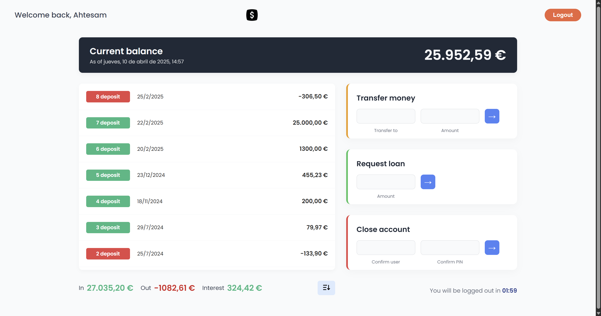

# 🏦 Bankist App

Welcome to **Bankist**, a sleek and simple online banking interface built entirely with vanilla **JavaScript**, **HTML**, and **CSS**. This project was a fun way to dive deeper into DOM manipulation and dynamic UI behaviors — no frameworks, just raw JS magic 😉.

## 📸 Preview

---

## 💼 What You Can Do

- 🔐 **Login** with a username and PIN  
- 💸 **Transfer money** between accounts  
- 🏦 **Request a loan** (with some validation logic)  
- ❌ **Close your account**  

All features are styled for **desktop screens** with responsive layouts and attention to clean UI design.

---

## 🧪 Test Accounts

Try it out using these demo credentials:

| Username | PIN  | Currency | Locale         |
|----------|------|----------|----------------|
| `js`     | 1111 | EUR      | de-DE          |
| `jd`     | 2222 | USD      | en-US          |

> ✨ Pro tip: After logging in, play around with transfers, loans, and account deletion to see the dynamic UI updates.

---

## 🛠️ Tech Used

- HTML5
- CSS3 (desktop-first design)
- JavaScript (ES6+)
- `Intl` API for locale & currency formatting
- `querySelector` and friends for DOM manipulation

---

## 🎯 Goal of the Project

This was a learning project to practice:
- JavaScript fundamentals
- DOM manipulation
- UI logic & interactivity
- Date & currency formatting with `Intl`
- Clean, modern design with CSS

> 🛑 This is a front-end-only app — no backend, no real authentication or persistent data.
